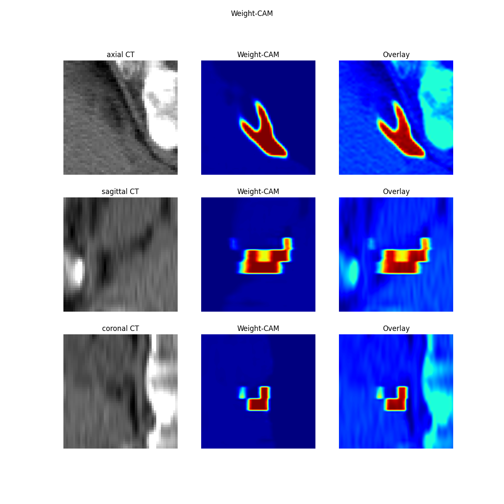

# CAM-demo-for-3d-medical-image-
Its a CAM(Class Activation Mapping) demo for 3d medical image.  (pytorch and UNet 3d)

Recently, I was using 3DUNET for CT image segmentation task, and found that I could not find the CAM code based on pytorch, so I uploaded a demo by myself.

My result picture：

Reference：

[Pytorch_hook机制的理解及利用register_forward_hook(hook)中间层输出](https://blog.csdn.net/foneone/article/details/107099060?spm=1001.2101.3001.6661.1&utm_medium=distribute.pc_relevant_t0.none-task-blog-2%7Edefault%7ECTRLIST%7ERate-1-107099060-blog-123301280.pc_relevant_3mothn_strategy_and_data_recovery&depth_1-utm_source=distribute.pc_relevant_t0.none-task-blog-2%7Edefault%7ECTRLIST%7ERate-1-107099060-blog-123301280.pc_relevant_3mothn_strategy_and_data_recovery&utm_relevant_index=1)

